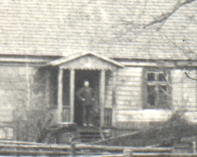

The years will pass; I will not be on this earth. My daughters, or maybe my grandchildren, may become interested in where their father, or grandfather, came from. Thus I am writing my life history.

I was born the 25th of June, 1907 at Digaini farm in Base district. _(Birth certificate shows 12_ _th_ _of June, 1907 in Moscow – Moscow was an error and the date from the old calendar.)_ I was born into a large family, we were five brothers and two sisters. The oldest brother was Adams, after him came sister Leva, brother Arturs, sister Alvine, myself, brother Janis and brother Alberts.

Father’s farm was in a beautiful hilly area at the crossroads of Alsunga-Aipute road and Liepaja-Aizpute road.

My first memories are from when I was six-years-old, before 1914 – the start of the first World War. Father was not keen on farm work, he employed a farm labourer (manager) to run the farm. At the crossroads father built a small house and opened a shop with goods that are necessary on farms: kerosene, sugar, flour, salted herring, tobacco. The shop was about one kilometre from the farmhouse.

Next to the shop there was a room where father lived. Since I was not at school and father needed someone to talk to, I lived with him at his shop. I was not happy about this because I did not have my older brothers to play with. Also, father was very strict. I was scared of him because he would not let me eat any sweets. All the sweet boxes were kept on high shelves that I could not reach. Once, when father was cutting wood outside, I climbed up the shelves. Just as I got up father came in and I got a belting for being disobedient.

Our lunch was brought from the farm by one of my brothers or sisters. Father made breakfast and dinner himself, usually tea and sandwiches. In the evenings father sent me in the shop to get some sugar; it was sugar cubes so I was able to put some quietly in my pocket.
