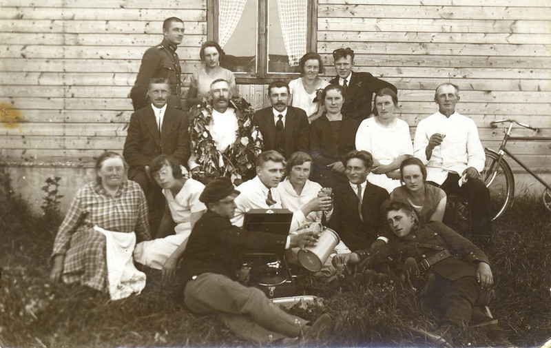
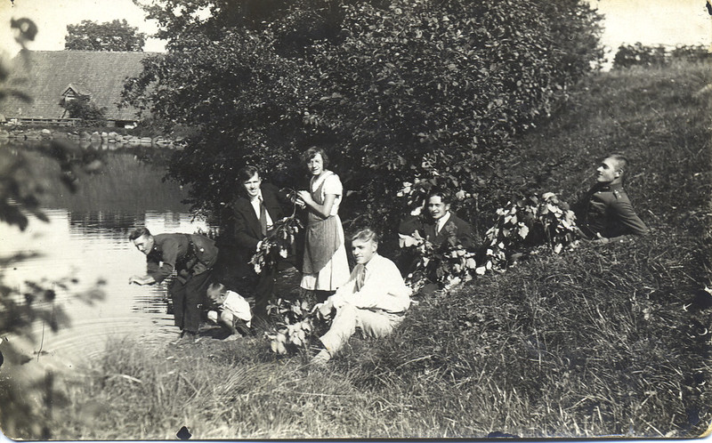

I had an excuse to make Ingas my first call in Snepele as it was a cream collection point.  So the following Sunday after work I went to Ingas.  I also knew there were four daughters as I had met them before when I was in the reserve army and came home for Christmas.  We went to Biezaisi where we had an invitation to go to Ingas to celebrate all together. The four daughters were the oldest, Marta, Paula, then Konstance and the youngest, Milda at 17, well grown and very shy.  I liked her from the first time I saw her and got her to dance with me even though she was so shy.

Now when I went to Ingas the second time I was much more experienced on the love side and had a good job.  I was young, unmarried, full of life, dressed in the latest fashion, and I had my record player.  I was asked to most parties in the district.  Soon after I arrived, Ingas had a big party for the confirmation of two daughters - Konstance and Milda.  I arrived full of bravado as I used to do in Vidzeme, but here in Kurzeme the daughters were proud and I made enemies instead of friends with Milda and her sisters - I was considered to be a show-off and conceited. The oldest, Marta, was considered an old maid at 26-27 years old.  She thought the world was a better place than I had found it, so we argued. With the younger sisters we just played. I was very ticklish and with three of them I had to give up. Marta was the one inviting me to Ingas, usually Saturday night. Their mother was also very kind to me.  After I made friends I found Milda very loving.  Milda had decided that my behaviour was an act, maybe to hide a very serious person.

