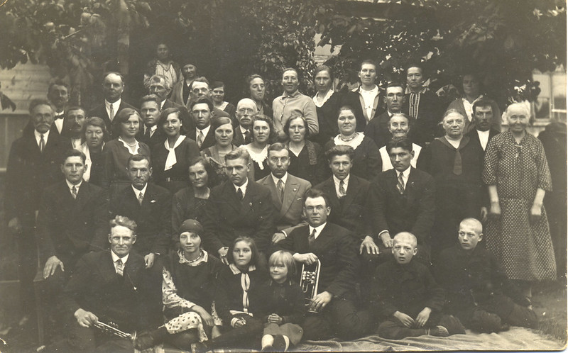

After about six months in Snepele my mother died, it gave me a big shock.  Her intestines had twisted and she was taken to Kuldiga hospital where they operated, but it was too late. I was going to see her every day, 20 kilometres on my bicycle, but she died within a few days. I bought the coffin myself, as my brothers were not prepared to pay anything. I was very upset when I went to Ingas, we were close friends with Milda by then, and she comforted me which made us even closer.  Milda’s brother Adolfs harnessed two horses to the best sprung carriage and we went to my father’s farm for the funeral.  Mother’s brother had come from Pavilosta (where mother was born) where he was a director of a Baptist wind ensemble.  My oldest brother carried the cross and the other four sons carried the coffin and we lowered it in the grave. It was autumn.

Also at the funeral were local people, about 50 altogether.
After mother died I went more frequently to Ingas, my friendship more strengthened.

I was getting tired of living alone and I thought a long time, one night I could not even sleep, and I had no one I could ask advice.  With Milda we had agreement, she had no special demands, and her only wish was for us to live together.  She knew of my affairs and of the visits I had from old girlfriends from Vidzeme staying sometimes a whole week. I thought that if we could not get on we could always divorce. I was already 25-years-old, but Milda was only 19.  In Latvia, if you were under 21-years-old you had to ask parents permission to marry.  Milda’s mother was aware that the time was close and her sisters knew, but I had to ask formally.  We arranged that both parents were in the small room and I announced that we were in love and wanted to get married.  Mother knew but Milda’s father was very surprised.  The wedding was arranged for autumn, as was usual in the country.  We sent out our engagement cards immediately.
