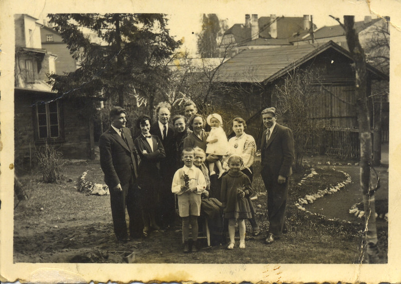

> Aija: _The above covers the years 1932-40. In 1935 I, Aija, was born. When I was one-year-old, I was very sick for months. It started with whooping cough, then I had a mystery illness which I believe was TB, as at this time Milda’s sister Kostance became chronically sick with it. Milda’s father died of it and her brother Sass was very sick with TB of the spine and spent 1 ½ years in hospital._

, Ingas 1937")

> Aija: _From the time I can remember, mother did not work in the factory and there were other employees and a part-time maid who minded me and did some cooking, cleaning, etc., she may have also worked in the factory.  During this time, father had a small shop, just as his father had had before.  It was in a small room at the end of the factory and offered essentials for the farmers: salt, sugar, herrings and sweets.  So now it was my time to climb the shelves to get some sweets, but I don’t remember ever being punished – anyway, I only liked two kinds: some very sour long sticks and halvah. Father himself ate boiled sweets all the time, even in bed._

