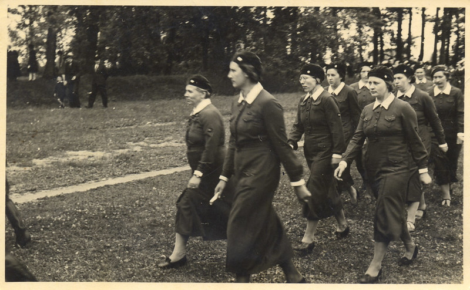

After only about a week, Milda’s mother quietly brought her daughter to my place one evening with all of her possessions.  At that time at the factory the living part consisted of a bedroom, a kitchen and a very large room that doubled as living room and office.  That is where we started our new life.  Because in autumn and winter there was not much milk, the factory operated only every second day.  We heated our rooms and kept warm as Milda’s health improved.  We were careful not to have children being so young - we wanted to enjoy our youth.  We had already before marriage joined an acting group and formed a theatre group with a local teacher, Juske, from across the road taking on the role of director.  The rehearsals were usually held in the large room at the factory.

Later, a women’s section was started for the civil guards, preparing the women in case of war to work in hospitals.  E.  Pormece became the director and the woman doctor who lived next door took on training in first aid.  Because at that time there were quite a few newly-married couples we also started learning folk dances and performed them after the play performances.  A weaving course was run to weave the folk dresses of Kuldiga district.
