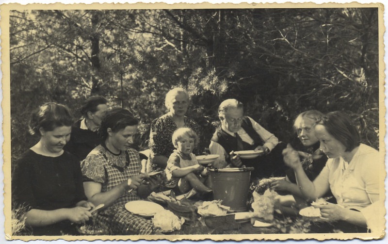

We had most of the rebuilding finished when the great upheaval started - Russians came in (communists).  Those that were in the National Guard were denounced as capitalist servants. Then imprisonment and people being sent to Siberia started.  From our friends, the National Guard captain Osnieks and Milda’s brother Adolfs with their families were taken on 14th June, 1941 (This was the day for mass arrests across Latvia).  The men were separated from their families and disappeared while the families were taken to Siberia and after the war many returned to Latvia.

The morning of June 15th there was a lot of anger amongst the milk deliverers because the Latvian district committee had issued a list announcing the unsuitable people for the present situation and the best workers and most reliable were listed.

Also, that morning a gypsy I knew named Rulle came in the factory and she asked for a drink of milk for which she was going to read the cards. I did not believe in fortune telling, but this one came true. She said, “You will be travelling across the oceans to a very distant land where you will start a new life.”  Believing it or not, I did travel to Australia, which is far.

> Aija: _On May 20th, 1940, Ruta was born, right in the middle of all the chaos.  A lot of the time mother, Ruta, the doctor neighbour and her family lived in a nearby forest where the maids of the two families, who were sisters, used to carry food secretly. 
I was at Ingas, and with Constance we lived in the fields and forest on the farm and had food drops arranged for us.  Father had an arrangement that he would be notified when the arresting officers would be coming and he had worked out a quick escape route.  We knew that we were on the list of people to be deported - some official who was friendly to father had told him secretly.  But because the Russians also wanted the butter produced at the factory our time was delayed. 
During the Russian occupation, all public places had to have an altar-like structure covered with red cloth and three very large portraits on the wall behind: Stalin, Lenin, and Gorki. To everybody’s amusement, father’s old, bad-tempered cat took up residence on this altar, but had to be watched if any officials visited._
