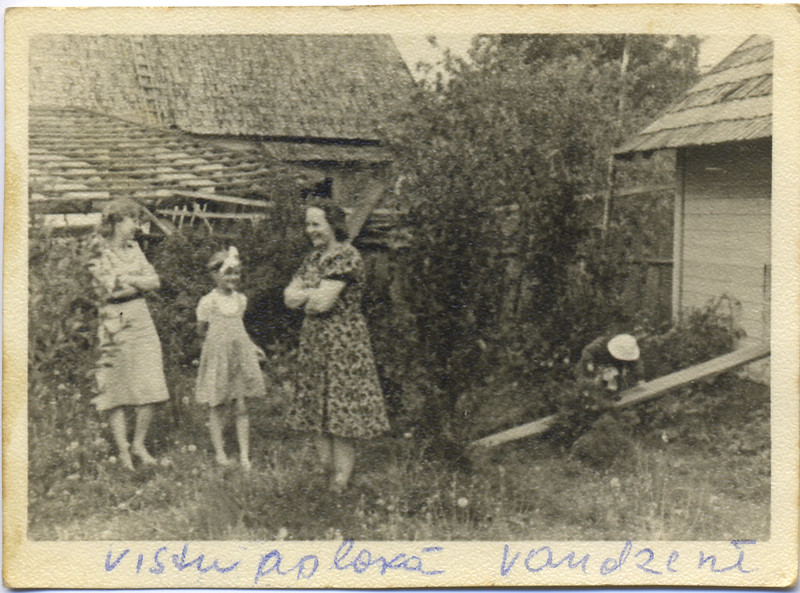

After about a week the investigator telephoned to say that there are a lot of problems at Vandzene milk factory, the manager had married a farmer’s only daughter and was going farming, so they needed a new manager urgently. The investigator was advising me to change jobs and he gave me the best references as an energetic manager.  It did not take me long to decide to take it up, and I gave notice to the committee.  Everybody was very surprised that I would leave after 13 years in the job.

> Aija: _The Vandzene factory was much larger; it also had large cellars under the main floor where cheese was made and a big boiler house which supplied the milk factory and the potato starch factory behind.  There was a proper flat one end of the building for our accommodation and separate offices upstairs.  Also included was a very large garden with every type of fruit tree and bushes of three different types: currants, gooseberries, and raspberries. Next door to the garden there was a farm with many glasshouses growing grapes, so I lived on fruit in the summer.  At the back of the garden was an elaborate chicken house in a wired yard. During our first spring there, mother ordered 20 or so chickens from a hatchery which became my charges during the summer holidays.  They kept me very busy as, having imprinted on me, they followed me everywhere._

, Talsi 1943")

> Aija: _That summer, father became very ill, and was diagnosed to have had paratyphoid after he was discharged from hospital.  During his stay in Talsi hospital, he would only drink fresh fruit juice so my job was to collect the fruit every morning. 
One of the milk collection points was by the seaside and the man who delivered it was a very large fisherman who was my friend.  Mornings when he had caught sole and smoked them overnight he would try to tiptoe into my bedroom in his big boots to leave me a freshly smoked sole.  I was always glad to see him.
In Vandzene, mother held many parties, mainly large dinner parties with loads of food and a big crowd.  Father would leave the party at about 10 PM, go to bed, and wake up at about 3 AM when people would start to leave and insist on partying on.  My room opened off to the large dining room that was used, and I insisted that the door be left partly open._
